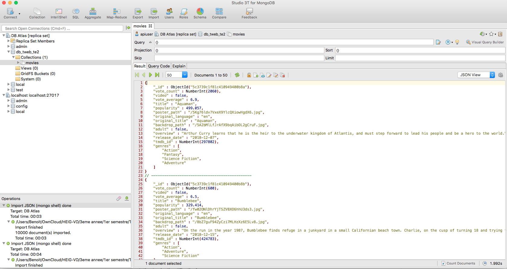

# The Movie Challenge

## Option 2 : Movie Time (backend)

L'api est disponible à l'url: https://tweb-te2-api.herokuapp.com/graphql

La base de données est déployée sur Atlas.

Le frontend du bonus est disponible à l'url: https://tweb-te2-front.herokuapp.com

### 1. Importer une collection de films (0.5pt)

**Répartion des points:**

- (1pt) – Les films ont étés importés dans un MongoDB local ou distant. Ajoutez un screenshot du résultat de l'opération dans votre README.md.




### 2. Liste des films (3pt)

Une fois la collection de films importée, vous allez devoir créer un model `Movie` ainsi qu'un endpoint permettant de récupérer une liste paginée des films.

**Répartion des points:**

- (1pt) – vous avez utilisé l’ORM de votre choix pour créer le model `Movie` contenant toutes les propriétés définies dans le dataset.
- (1pt) – vous avez créé un endpoint /movies permettant de récupérer la liste complète des films.
- (1pt) - vous avez utilisé la méthode de votre choix pour paginer les résultats de cet endpoint.

Je vous ai fait les 2 endpoints suivants :

- ```
  # Retourne tous les films de la base de données.
  movies(nbMoviesPerPage: Int, page: Int): [Movies!]!
  
  # Retourne le film correspondant au 'movieId' reçu.
  movie(movieId: ID!) : Movies
  ```

La pagination vous retourne *nbMoviesPerPage* films à partir de la page *page*. Donc, si vous faite la query ci-dessous, vous obtenez les films 11 à 15 (classés par ordre croissant d'id).

```
query {
  movies (nbMoviesPerPage: 2,page: 0){
    id
    vote_count
    video
    vote_average
    title
    popularity
    poster_path
    original_language
    original_title
    backdrop_path
    adult
    overview
    release_date
    tmdb_id
    genres
  }
}
```

### 3. Authentification (3pt)

**Répartition des points:**

- (1pt) – le Model `User` contient au minium le nom d'utilisateur ou l'email, ainsi que le mot de passe. Pour ce challenge, nous acceptons les mots de passe stockés en clair à condition qu’ils ne soient jamais retournés à l’utilisateur.
- (1pt) – lors de la création d'un nouvel utilisateur, l'API envoie le status `201 Created`. Le nom d'utilisateur et l'email sont uniques.
- (1pt) – lors du login, l'API retourne un token de type JWT qui contient au minimum l'id de l'utilisateur.
- *(BONUS 0.5pt) – vous avez implémenté (à la main ou à l'aide d'une libraire) un middleware qui attache l’utilisateur courant à l’objet requête `req.user`.* 

Le model mongoose *user* contient les champs suivants:

```
firstname
lastname
email
password
watchList
```

Le mot de passe est crypté à l'aide de la librairie *bcrypt* (n'oubliez pas de définir votre secret dans le .env) et ne sont pas récupérable par l'utilisateur. Ils ne peuvent pas non plus être modifié…!^^

L'email est unique. Lors de l'inscription d'un nouvel utilisateur, une erreur est levée et l'inscription échoue si l'email est déjà enregistré dans la base de données. Un éventuel frontend pourrait vérifier l'existence d'un email dans la base de données à l'aide du endpoint suivant :

```
checkIfEmailIsAvailable(email: String!): Boolean!
```

L'authentification se fait à l'aide des 2 endpoints suivants :

```
# Permet à un utilisateur inscrit de se connecter à son compte.
login(email: String!, password: String!): Token!

# Permet à un nouvel utilisateur de s'inscrire et se créer un compte.
signUp(newUser: UserInputAdd!): Token!
```

Le token de connexion contient l'email et l'id de l'utilisateur. Lors d'une requête, un middleware récupère un token passé dans l'entête *x-token* et s'il est valide, insère l'utilisateur correspondant dans le contexte (voir *App.js*).

### 4. Watchlist (2pt)

**Répartition des points:**

- (1pt) - il est possible de récupérer la liste des films se trouvant dans la watchlist d’un utilisateur (retourner une liste d’identifiants n’est pas suffisant).
- (1pt) – il est possible d'ajouter un film dans la *watchlist* d’un utilisateur. 
- *(BONUS 0.5pt) : vous avez sécurisé les endpoints afin de les rendres accessibles uniquement aux utilisateurs connectés. Utiliser l’id de l’utilisateur connecté lors de l’ajout d’un film dans une watchlist.*

La watchlist d'un utilisateur est récupérable dans les informations d'un utilisateur à l'aide des endpoints suivant permettant de récupérer un ou plusieurs utilisateurs :

```
# Retourne tous les utilisateurs de la base de données.
users(nbUsersPerPage: Int, page: Int): [User!]!

# Retourne l'utilisateur correspondant au 'userId' reçu.
user(userId: ID!) : User
```

Il est possible d'ajouter ou supprimer un film de la watchlist d'un utilisateur à l'aide des 2 endpoints suivants:

```
# Permet d'ajouter le film correspondant à l'id 'movieId' à la watchlist de l'utilisateur correspondant à l'id 'userId'
addMovieToWatchList(userId: ID!, movieId: ID!): User

# Permet de supprimer le film correspondant à l'id 'movieId' de la watchlist de l'utilisateur correspondant à l'id 'userId'
removeMovieToWatchList(userId: ID!, movieId: ID!): User
```

Ces 2 endpoints ne sont accessibles qu'à un utilisateur connecté. De plus, l'action ne réussira que si laid de l'utilsiateur connecté (stoqué dans son token et donc dans le contexte) correspond à l'id du paramètre *userId*. Autrement dit, un utilisateur connecté ne peut modifier que ses propres informations et pas celle d'un autre utilisateur.

De plus, lors de l'ajout d'un film à la watchlist de l'utilisateur, un hook mongoose vérifie automatiquement que l'id du film reçu soit bien présent dans la collection *movies*. Une erreur est levé et l'ajout échoue si ça n'est pas le cas. 

### 5. (Bonus) Formulaire de login (0.5pt)

Je m'ennuyais un peu, du coup, je vous ai fait un formulaire de login et un formulaire d'inscription.

Ils sont disponibles ici :

```
https://tweb-te2-front.herokuapp.com/login
https://tweb-te2-front.herokuapp.com/sign-up
```


### 6. Qualité du code (1.25pt)

Les points pour cette étape sont répartis de la manière suivante :

- (0.25pt) – la structure des fichiers est cohérente.
- (0.25pt) – tout code non utilisé est supprimé y compris les logs de debug dans la console.
- (0.25pt) – votre code est suffisament documenté lorsque cela est nécessaire.
- (0.25pt) – vous utilisez un linter.
-  (0.25pt) – les variables d’environnement sont utilisées lorsque cela est nécessaire.
- *(BONUS 0.5pt): vous avez créé au moins un test unitaire afin de valider la fonctionnalité de votre choix.*

### 7. Déploiement (0.5pt)

Finalement vous devez déployer votre API et votre base de données sur la plateforme de votre choix.
